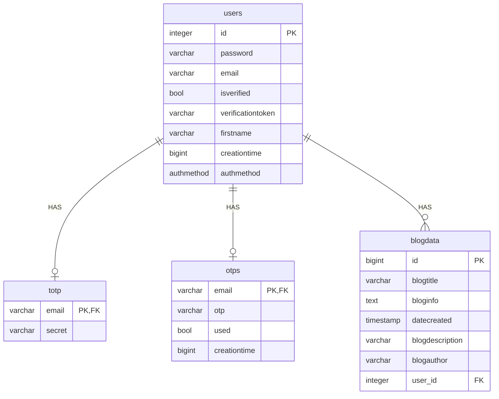

# Speak Your Mind 


Speak Your Mind is a secure web based blog where users can freely express
 their and popular or unpopular opinions as well as read others own 
without being judged. It ha been coded to mitigate against the following 
security vulnerabilities:
1. Account enumeration
2. Session hijacking
3. SQL injection
4. Cross-site scripting
5. Cross-site request forgery
6. DDOS
7. ClickJacking

## Table of contents

* [Overview](#Overview)
* [ThePhish example usage](#thephish-example-usage)
    + [A user sends an email to ThePhish](#a-user-sends-an-email-to-thephish)
    + [The analyst analyzes the email](#the-analyst-analyzes-the-email)
* [Implementation](#implementation)
* [Installation](#installation)
    + [Install it using Docker and Docker Compose](#install-it-using-docker-and-docker-compose)
    + [Install it from scratch](#install-it-from-scratch)
* [Configure the analyzers](#configure-the-analyzers)
    + [Configure the levels of the analyzers](#configure-the-levels-of-the-analyzers)
    + [Tested analyzers](#tested-analyzers)
    + [Enable the *MISP* analyzer](#enable-the-misp-analyzer)
    + [Enable the *Yara* analyzer](#enable-the-yara-analyzer)
* [Enable the *Mailer* responder](#enable-the-mailer-responder)
* [Use the whitelist](#use-the-whitelist)
* [Contribution to TheHive4py](#contribution-to-thehive4py)
* [License](#license)
* [Academic publications](#academic-publications)
* [GitHub repositories mentioning ThePhish](#github-repositories-mentioning-thephish)
* [Who talks about ThePhish](#who-talks-about-thephish)
* [Credits](#credits)


## Overview

The following explains how Speak Your Mind works at high-level:
1. User signs-up using a valid email
2. User must verify their email
3. If totp is selected as authentication, user must set up their totp. If email selected, email is verified and user will be re-directed to login. 
4. User inputs their login and email and is transferred to their selected Two Factor Authentication (2FA) Method. 
5. User is authenticated after completing their chosen 2FA method. 
6. User is authenticated and can now add,edit,and delete their blog posts.
7. Users can read and search other blog posts.


## Implementation

The application is a web application whereby the front end is written using
HTML, CSS, EJS and JavaScript whiles the backend is written using Node.js and Express.
It stores and retrieves data from PostGresSQL.

## Installation

### Install Node.js packages
The following node.js packages needs to be installed for the program to work:
express, https, body-parser, node-mailer, fs, ejs, crypto, node-postgres and many more. 
To summarise, ensure that all packages listed in the server.js file are properly installed. 
You can do so by typing this command in terminal e.g: To install node-postgres run the following:
```
npm install pg  
```

### Generate Self-Signed SSL/TS certificate
The website is connected through Node.js https server. This requires
self-signed certificates for this to work. To attain this certificates you will need 
to go to terminal and type the following commands:

1. Generate a private key file 
```
openssl genrsa -out mydomain.local+3-key.pem 2048
```
2. Generating a certificate signing request
```
openssl req -new -key mydomain.local+3-key.pem -out mydomain.local+3.csr
```
3. Generate a self-signed SSL certificate
```
openssl x509 -req -in mydomain.local+3.csr -signkey mydomain.local+3-key.pem -out mydomain.local+3.pem
```
If you want to change the names of the files make sure to change the filename of the
code that reads the files as shown below:
```javascript
const options = {
    key: fs.readFileSync('mydomain.local+3-key.pem'),
    cert: fs.readFileSync('mydomain.local+3.pem')
};
const server = https.createServer(options, app);
server.listen(port, () => {
    console.log('Server running at https://localhost:8080/');
});
```
Once this is done, confirm that your server is running successfully by 
going to terminal and typing the following:
```
node server.js
```
The above will run the server.js file. Although, everything has 
been installed, the application won't function properly because
the PostgreSQL database needs to be set up. 

## Database Configuration
In order for the application to work, you will need to create a set up a database.
Below is an Entity Relationship Diagram to help you be able to set up a database.



    

Below is additional information you need to complete
the database configuration:

Kindly note that the "public" 
is the default name of the database schema.
If you change the schema name to anything else,
then public should be changed to the new schema name. 

1. The type authmethod is an enum type created
using the following SQL query:
```postgresql
CREATE TYPE public.authmethod AS ENUM (
    'email',
    'totp'
);
```
2. You will need to set all the ids to have auto
increment. 
   ```postgresql
   /*Set the user id to autoincrement*/
   CREATE SEQUENCE public.users_id_seq1
    AS integer
    START WITH 1
    INCREMENT BY 1
    NO MINVALUE
    NO MAXVALUE
    CACHE 1;
   
   ALTER SEQUENCE public.users_id_seq1 OWNED BY public.users.id;

   /*Set the blog data id to autoincrement*/
   CREATE SEQUENCE public."blogData_id_seq"
    START WITH 1
    INCREMENT BY 1
    NO MINVALUE
    NO MAXVALUE
    CACHE 1;
   
   ALTER SEQUENCE public."blogData_id_seq" OWNED BY public.blogdata.id;
   ```

### User Roles
In the application you will need to create 3 different types of user roles:
1. A read-write user that only has permissions to select on all the tables:
    An example can be seen down below. You can change the password, the name
   of the user and the blogdatabase name to one of your choice
```postgresql
CREATE ROLE readonly_user WITH LOGIN PASSWORD 'mypassword' NOSUPERUSER NOCREATEDB NOCREATEROLE;
GRANT CONNECT ON DATABASE mydatabase TO readonly_user;
GRANT SELECT ON ALL TABLES IN SCHEMA public TO readonly_user;
GRANT USAGE, SELECT ON ALL SEQUENCES IN SCHEMA public TO readonly_user;
```
2. A write-only user that permissions to insert, delete, and update all the tables
in the database
  ```postgresql
CREATE ROLE writeonly_user WITH LOGIN PASSWORD 'mypassword' NOSUPERUSER NOCREATEDB NOCREATEROLE;
GRANT CONNECT ON DATABASE mydatabase TO writeonly_user;
GRANT INSERT, UPDATE, DELETE ON ALL TABLES IN SCHEMA public TO writeonly_user;
GRANT USAGE, INSERT, UPDATE, DELETE ON ALL SEQUENCES IN SCHEMA public TO writeonly_user;
``` 

3. A readwrite user that selects, inserts, delete, update and delete. 


## Academic publications
- ITASEC 2022: Italian Conference on Cybersecurity, June 20–23, 2022, Rome, Italy
    - Link to the proceedings: https://ceur-ws.org/Vol-3260/
    - Link to the paper: https://ceur-ws.org/Vol-3260/paper6.pdf
    
